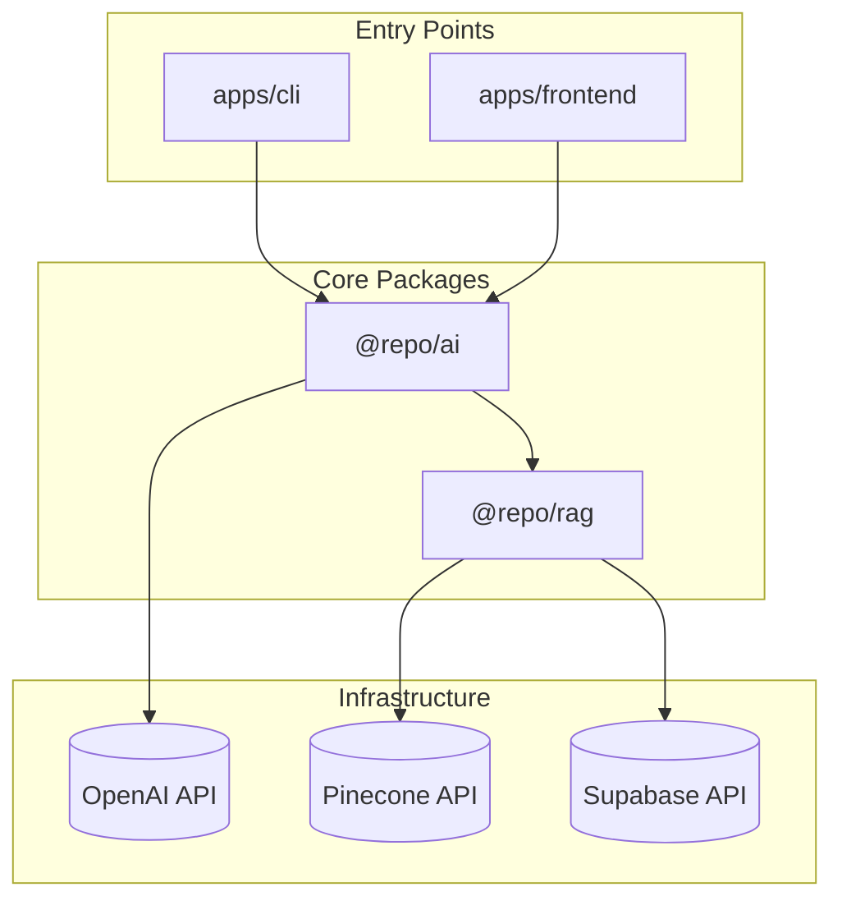
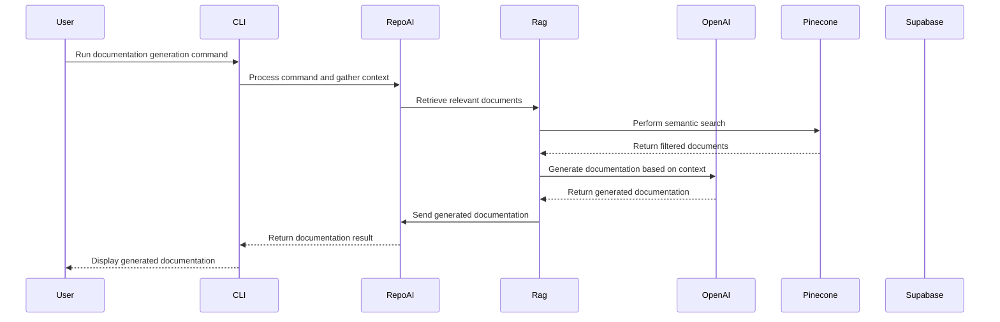
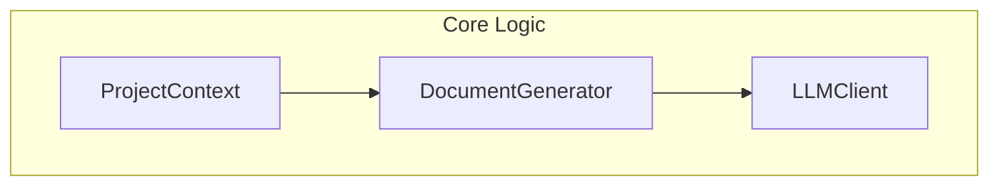

# Architecture Document for DXGen Project

## 1. Introduction & High-Level Overview
The DXGen project is an AI Documentation Agent designed to facilitate the generation of documentation through a CLI-first approach. It is structured as a monorepo, containing multiple applications and packages, including a CLI application and a frontend application. Key external services utilized in this project include LangChain, Supabase, OpenAI, and Pinecone, which enhance the functionality of the documentation generation process.

## 2. System Context & Architecture

The architecture consists of two main entry points: the CLI and the frontend application. Both entry points interact with the core package `@repo/ai`, which is responsible for the main logic of the documentation generation. The `@repo/rag` package is utilized for retrieval-augmented generation, leveraging external services such as OpenAI for language model interactions, Pinecone for semantic search, and Supabase for data storage and management. This structure allows for a clear separation of concerns and modularity within the project.

## 3. Core End-to-End Flow (Behavioral View)

The following flow illustrates the primary user journey when generating documentation via the CLI:

This sequence diagram outlines the flow from the user executing a command in the CLI to the final output of generated documentation. The process involves retrieving relevant documents from Pinecone, generating content using OpenAI, and returning the results to the user through the CLI.

## 4. Optional Focused Views

### Internal Structure of `@repo/ai`
This diagram provides a focused view of the internal structure of the `@repo/ai` package, highlighting its key components and their interactions.

The `@repo/ai` package contains essential components such as `ProjectContext`, which analyzes the project structure, `DocumentGenerator`, which orchestrates the documentation generation process, and `LLMClient`, which interacts with external language models.

## 5. Architectural Summary & Coverage Check
- **Main Apps**:
  - **CLI**: Entry point for users to generate documentation.
  - **Frontend**: Provides a user interface for documentation management.
  
- **Key Internal Packages**:
  - **@repo/ai**: Core logic for documentation generation.
  - **@repo/rag**: Handles retrieval-augmented generation processes.

- **Important External Services**:
  - **OpenAI**: Used for generating documentation content.
  - **Pinecone**: Provides semantic search capabilities.
  - **Supabase**: Manages data storage and retrieval.

### Coverage Check
- All major entry points from the project context (CLI and Frontend) are represented in the diagrams.
- All main external services (OpenAI, Pinecone, Supabase) are included where relevant.
- No major components from the context are omitted; the architecture reflects the complete system structure and flow.